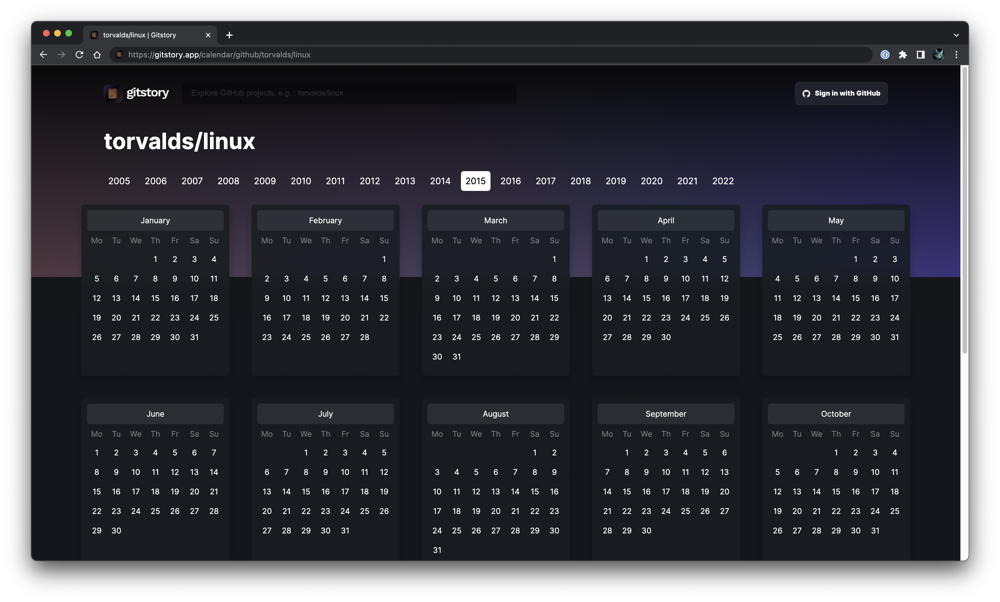

 
  
  

 
  

 
 
 

GitStory is a Wayback Time machine app for GitHub projects, powered by the GitHub API.

- 📆 Use the Reactive calendar to go back in time.
- 🌴 Check commits by day, month and year.
- 🔎 Scan for commits activity of a given month by clicking on the month button in the calendar.
- 📸 Explore "snapshots" of GitHub repositories by navigating to the exact commit.
- 🌍 Explore and see the beginnings of popular Open source projects.

Got any features ideas ? Feel free to submit yours!

> ⚠️ GitStory is still in Beta, please feel free to report bugs you might find, thanks!

# Kit

GitStoryKit is light Javascript library that allows easy time back actions, it is used in GitStory.

[Repository](https://github.com/swve/gitstorykit)

# Sponsors

<a href="https://vercel.com/?utm_source=graphicmade&utm_campaign=oss#gh-light-mode-only"></img></a>

<a href="https://vercel.com/?utm_source=graphicmade&utm_campaign=oss#gh-dark-mode-only"></img></a>

# Contributing

To contribute or understand the code structure,
please see our [contributing.md](/CONTRIBUTING.md).

# Authors

Badr B. ([@swve](https://github.com/swve))
